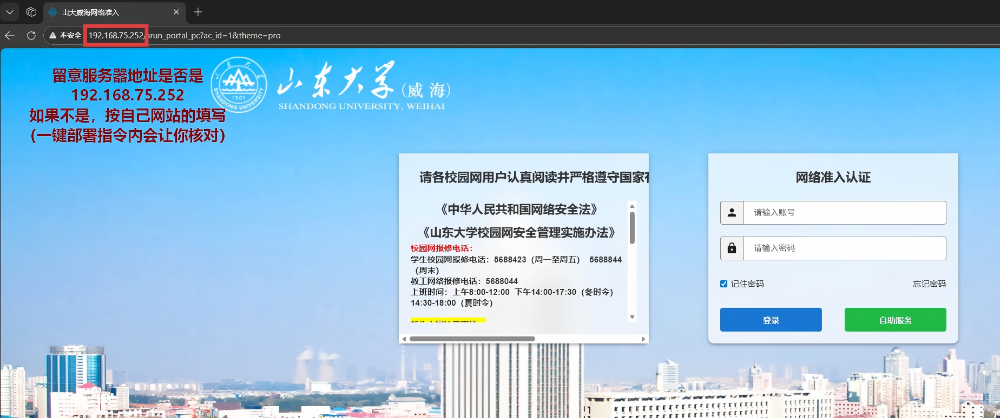

# 山东大学校园网自动登录

山东大学校园网（深澜/Srun 认证）自动连接工具。支持 Windows 和 Linux，零依赖，一键部署，开机自动登录，断网每5分钟自动检测并重连。



### 📺 演示视频

https://github.com/user-attachments/assets/39da9525-80cf-4815-9b7e-879fd425806f

## 零依赖

- Windows：仅需 PowerShell（Win10/11 自带）
- Linux：仅需 bash + curl + openssl（系统预装）

无需安装 Python 或任何第三方库，双击即用。

## 一键部署

| 系统 | 操作 |
|------|------|
| Windows | 双击 `一键部署_Windows.bat` |
| Linux | `chmod +x 一键部署_linux.sh && ./一键部署_linux.sh` |

> ⚠️ Windows 首次打开可能弹出"无法验证发布者"安全提示，点击「运行」即可，这是所有从网上下载的脚本都会出现的正常现象。

按提示输入学号和密码即可，部署后每次开机自动登录校园网。

## 日常使用

- 部署完成后无需任何操作，开机自动登录
- 断网自动重连（每5分钟检测一次）

**Windows 手动操作：**
- 手动登录：双击 `手动登录.bat`
- 卸载自启：双击 `卸载自启.bat`
- 验证自启：双击 `验证自启动.bat`

**Linux 手动操作：**
```bash
bash srun_login.sh                              # 手动登录
systemctl --user status srun-login              # 查看状态
systemctl --user restart srun-login             # 重启服务
systemctl --user disable --now srun-login       # 卸载自启
```

## 文件说明

| 文件 | 用途 |
|------|------|
| `srun_login.ps1` | Windows 主程序（PowerShell） |
| `srun_login.sh` | Linux 主程序（bash+curl+openssl） |
| `一键部署_Windows.bat` | Windows 一键部署 |
| `一键部署_linux.sh` | Linux 一键部署 |
| `手动登录.bat` | Windows 手动登录 |
| `卸载自启.bat` | Windows 卸载自启 |
| `验证自启动.bat` | Windows 验证自启动是否配置成功 |
| `config.ini` | 部署后自动生成，保存账号密码 |

## 🌟 支持项目

如果这个工具帮你省去了每天手动登录校园网的烦恼，欢迎：

- ⭐ 给本项目点个 **Star** 让更多同学看到
- 🔗 **转发给室友、同学、班群、年级群**，帮大家一起告别手动登录
- 💬 提交 Issue 反馈问题或建议

每一个 Star 和转发都是对作者最大的鼓励 💪，也能帮助更多山大同学受益！🎓
